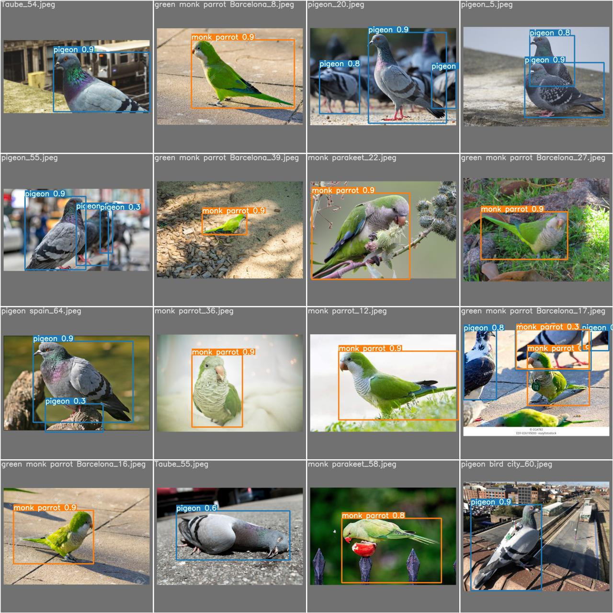
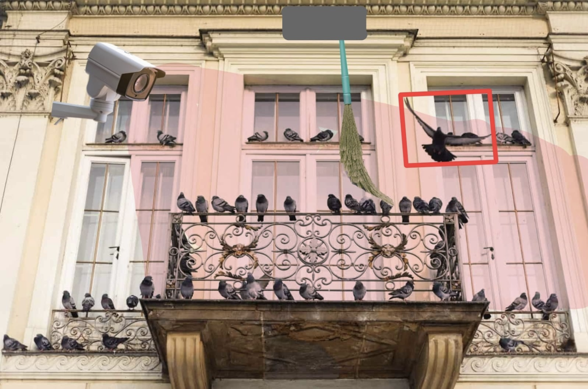
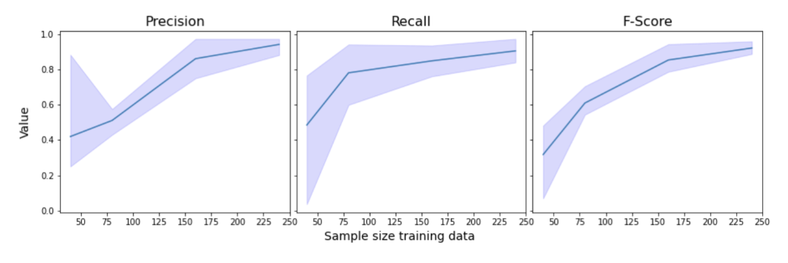
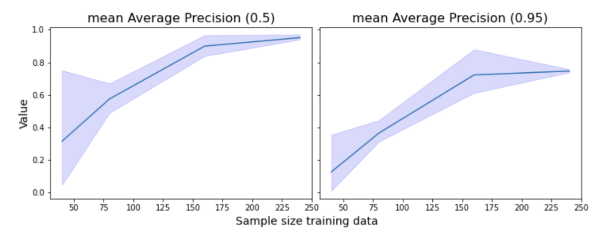

# Training a custom pigeon detector with YOLOv7

In this project, we train and test the YOLOv7 object detection algorithm on a custom dataset of pigeons and monk parrots. We originally trained the model on Google Colab (for GPU capability) with a dataset of over 240 images. This repository is adapted to demonstrate our methods and share our principle results. A detailed writeup of our project can be found in `pigeon-detector-report.pdf`, a written report submitted as our final project for the Spring 2023 course Deep Learning, taught by Vicenç Gomez at Universitat Pompeu Fabra.

In the `code` folder we have:

* `bird_dataset` A folder that includes a small subsample of our custom dataset.
* `config_files` A folder that contains custom configuration files for the YOLOv7 model.
* `experiments.py` A python script that trains YOLOv7 on training sets of various sizes. 
* `helper_functions.py` Helper functions for the above.
* `download_images.py` A simple script for downloading training images from the Internet.

Please note that this code will only train the model if one clones the [YOLOv7 repository](https://github.com/WongKinYiu/yolov7.git). Copy `experiments.py`,`helper_functions.py`, and the `bird_dataset` into the cloned `yolov7` folder, and place the custom configuration files into `yolov7/data`.

## Why detect pigeons?

The idea for our project arose from our experiences living in a place with many pigeons: the center of Barcelona. Often, they occupy balconies or ceilings and leave their excrement behind. As the number of people exposed to this issue is high, many products are advertised as solutions to the problem. From our own experience, placing a plastic owl or glitter pompoms on a balcony might have a short-term effect by shooing away pigeons. However, after a brief period, the pesky creatures get accustomed to these static solutions and return to occupy their favored places. However, while pigeons get used to stationary devices, they remain afraid of objects moving in their direction. Shooing them away with a broom remains an effective option, but requires one to constantly observe the balcony with a broom in reach to be prepared for the case of a winged interloper landing on one's property.

These issues made us realize there is demand for a more advanced solution leveraging the capabilities of deep learning. In particular, we want to use computer vision to detect pigeons and transmit their location to a robotic device executing a rapid movement of a broom in the direction of the threat. To create such a mechanism, we must overcome several challenges to make it effective and safe. It needs to identify and locate pigeons in real-time while not proposing a threat to other animals or humans using the balcony. 

The YOLO object detection algorithm is the perfect solution to resolve some main challenges. It lets us train the model to identify pigeons in real-time and distinguish them from other animals and humans.

## Data

In order to train our model to detect pigeons and monk parrots, we collected and hand-annotated over 240 pictures from the Internet using the open-source tool LabelImg. The dataset was nearly balanced, with 113 photos featuring mostly pigeons and 131 photos featuring mostly monk parrots. In only a few training images did the two types of birds appear together. Pictures were a variety of sizes and aspect ratios.

## Results

We trained the YOLOv7 model on randomized subsamples of the full dataset to assess the model's performance in terms of precision and recall on different sample sizes. Through experimentation, we noticed that the default learning of rate of 0.01 was too big and that the model was losing precision during training. Thus we changed the learning rate to 0.001, which resulted in slower but much more stable learning. Within 100 epochs, the model achieved a precision over 0.9 and recall over 0.87 on the test set. This result made us confident that our model could work, and thus we proceeded with our experiments.

The results of our experiments were as expected. In general, precision was higher for  monk parrots than for pigeons. This makes sense because monk parrots, with their distinctive green feathers, stand out much more from a city background than the dowdy gray pigeon. As sample size increased, so did precision and recall. The model's ability to recognize and accurately label pigeons and birds was low with a sample size of 40 (and thus only 32 training pictures). However, its performance greatly improved and leveled out at a sample size of 160 (128 training pictures). 

If the IoU threshold is set to 0.5, the model has nearly perfect mean average precision with sample size 240 (192 training pictures). Training on a set this size for 100 epochs took approximately one hour. These results demonstrate that with a relatively small training set, one can train a fairly accurate pigeon detector that can differentiate between pigeons and monk parrots. 

In testing the model, we came across a few limitations of our training approach. Namely, that we should have included humans as a third class in our training. For example, when we showed the model images that included humans, the model predicted that the humans were pigeons. We believe this is because most of the training data were close-up photos of pigeons and parrots. The model was trained to find large pigeons at the center of the image. Thus when it is shown an image where humans are large and pigeons are small, it assumes that the humans are pigeons. This deficiency must be addressed before being put into production, lest the pigeon shooing device whack its own owner if he or she steps out onto their balcony for a pigeon-free smoke. This issue could be solved by training the model to detect humans as well, and showing it more images where pigeons are small relative to the whole image.